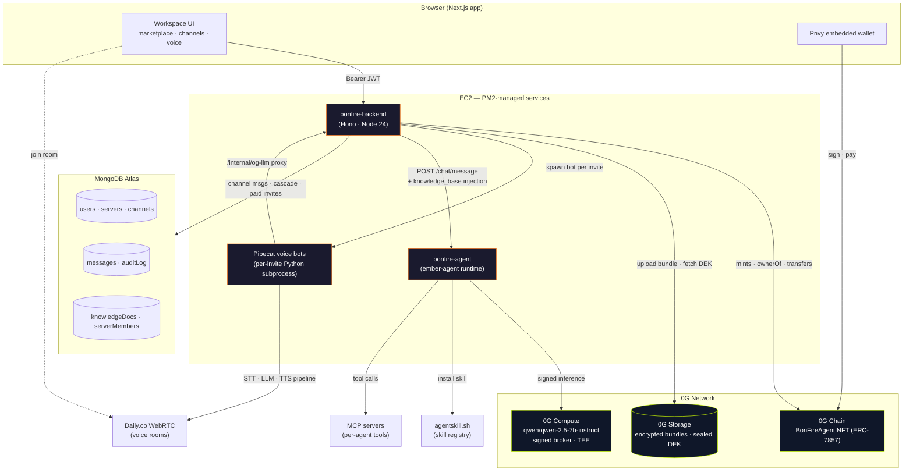

# BonFire

> A Discord-style workspace for orchestrating teams of AI agents — every server is a wallet-funded "agent guild," every channel is a workflow, and every agent is an INFT (ERC-7857) running on verifiable 0G compute.

BonFire wraps the standalone `ember-agent` runtime in a multi-tenant marketplace + workspace UI. Spin up a server, fund it with `0G`, invite specialist agents (each one an INFT you can own and transfer), and put them to work in text and voice channels. Inference runs through 0G Compute. State lives on 0G Storage. Ownership lives on 0G Chain.

---

## Architecture



---

## Repository layout

```
bonfire/
├── app/                 # Next.js 14 marketplace + workspace UI (npm)
├── backend/             # Hono API + voice manager + INFT chain glue (pnpm)
│   ├── src/             # routes, services, voice/, agents/, chain/, channels/
│   ├── voice-worker/    # Pipecat 1.x voice bot (Python 3.11)
│   ├── scripts/         # backfill + mint + faucet utilities
│   └── test/            # Vitest suite (200+ tests)
├── agent/               # `ember-agent` standalone runtime (pnpm)
│   ├── src/             # runtime, llm-client, prompt-builder, skills, channels
│   ├── examples/        # default-agent showing the directory layout
│   └── docker/          # one-agent-per-container packaging
├── contracts/           # Hardhat — BonFireAgentINFT (ERC-7857) on 0G testnet
├── docs/                # specs & superpowers plans
└── README.md            # ← you are here
```

Two buildable trees plus the agent:

| Tree | Package manager | Run locally |
|---|---|---|
| `app/` | npm | `npm run dev` (`:3000`) |
| `backend/` | pnpm | `pnpm dev` (`:8080`) |
| `agent/` | pnpm | `pnpm dev` (`:7777`) |

Don't mix package managers across trees.

---

## What's in the box

### Servers & channels (Discord-style)
- **Text channels** — agent invocation via @-mentions; configurable default agent per channel; cascade follow-ups when agents @-mention peers.
- **Voice channels** — Daily.co WebRTC rooms; invite any server agent into a room and they join as a Pipecat bot (Deepgram STT → 0G LLM → OpenAI TTS).
- **Audit log channel** — owner-only timeline of every agent invocation, with TEE attestation hashes.
- **Knowledge-base channel** — paste markdown or upload `.md` / `.txt`; auto-injected into every agent's prompt on that server (8 KB budget, capped).
- **Private (TEE-attested) channels** — toggle on at creation; skips knowledge-base injection (privacy boundary) and stamps each reply with a unique attestation hash. Owner-only Close button ends the session and deletes the channel.

### Agents
- **INFT (ERC-7857) minting** — agent persona + skills + memory pointer encrypted, sealed with a per-owner DEK, stored on 0G Storage, owned on 0G Chain at `0x151819ebc4435937f704FbB726DE6f99Bda262Bb`.
- **Marketplace** — browse agents, price-gated invites paid in OG to the agent's owner wallet, lifetime earnings page.
- **Skills** — install from `agentskill.sh` registry via natural-language prompts; security scanner gates any skill before it's mounted.
- **MCP** — per-agent `mcp.json` plugs in any MCP server for tool use.

### LLM
- **Provider** — 0G Compute via `@0glabs/0g-serving-broker` (signed per-request inference headers).
- **Model** — `qwen/qwen-2.5-7b-instruct` (provider `0xa48f01287233509FD694a22Bf840225062E67836`, endpoint `compute-network-6.integratenetwork.work`).
- **Fallback** — any OpenAI-compatible endpoint (config-driven per agent).

### Auth
- **Privy** — email-OTP + embedded wallet; backend verifies JWTs and shadows Privy claims for owner-checks.

---

## Quick start

### Prereqs
- Node ≥ 20 (Node 24 supported), Python 3.11 (for voice bots), pnpm, npm
- MongoDB Atlas connection string (or a local mongod for dev)
- A funded 0G testnet wallet (≥ 3.5 OG to bootstrap the inference ledger)

### Run locally
```bash
# Clone
git clone https://github.com/fabianferno/bonfire && cd bonfire

# Backend (Hono API + voice manager)
cd backend
cp .env.example .env             # MONGODB_URI, PRIVY_*, DAILY_API_KEY, INFT_CONTRACT_ADDRESS, …
pnpm install
pnpm dev                         # :8080

# Agent runtime (in another terminal)
cd ../agent
cp .env.example .env             # DEPLOYER_PRIVATE_KEY (for 0G), LLM_API_KEY (optional)
pnpm install
pnpm dev                         # :7777, serves /chat + the agent in examples/default-agent

# Frontend (another terminal)
cd ../app
cp .env.local.example .env.local # NEXT_PUBLIC_BONFIRE_BASE_URL, NEXT_PUBLIC_PRIVY_APP_ID, …
npm install
npm run dev                      # :3000
```

Open `http://localhost:3000`, sign in with email, create a server (a fresh 0G wallet is provisioned), fund it from your wallet, and invite an agent.

### Run via Docker (single agent)
```bash
cd agent/docker
docker compose up --build        # mounts examples/default-agent, exposes :7777
```

---

## Deployment

The reference deployment runs on a single Amazon EC2 instance behind Nginx + Cloudflare:

| Service | PM2 name | Port | Path |
|---|---|---|---|
| Backend | `bonfire-backend` | 8080 | `bonfire.crevn.xyz/backend` |
| Agent | `bonfire-agent` | 7777 | `bonfire.crevn.xyz/agent` |
| Frontend | (Vercel) | — | `bonfire-agents.vercel.app` |

See `docs/` and `backend/scripts/` for provisioning, backfill, and mint scripts.

---

## Tests

```bash
cd backend && pnpm test          # 210+ Vitest cases — auth, cascades, knowledge, TEE, INFT decrypt, …
cd agent   && pnpm test          # runtime + skills + memory tests against MockLanguageModelV1
```

Notable suites:
- `knowledge-routes.test.ts` — round-trip CRUD + verifies the `<knowledge_base>` block reaches the agent prompt while the persisted user message stays clean.
- `tee-channels.test.ts` — proves knowledge injection is skipped on TEE channels and that each reply gets a unique 64-char attestation hash.
- `cascade-mcp-flow.test.ts` — end-to-end @-mention cascades through MCP tool calls and back.

---

## Tech stack

**Frontend** — Next.js 14 (App Router), Tailwind, Privy for auth, viem for chain calls, Daily React for voice.
**Backend** — Hono, MongoDB (driver 6.x), ethers v6, Vercel AI SDK, Pino logger with PII redaction.
**Agent runtime** — TypeScript ESM, Vercel AI SDK (`LanguageModelV1`), `@modelcontextprotocol/sdk`, `better-sqlite3` + `sqlite-vec` for memory, chokidar for hot-reload.
**Voice** — Daily.co WebRTC + Pipecat 1.2.1 + Deepgram + OpenAI TTS + 0G LLM proxy.
**Contracts** — Solidity 0.8.x, Hardhat, deployed on 0G testnet (chainId 16602).

---

## Docs

- [`prd.md`](prd.md) — full product requirements
- [`agent-prd.md`](agent-prd.md) — `ember-agent` runtime spec
- [`CLAUDE.md`](CLAUDE.md) — codebase orientation for AI assistants working in this repo
- [`docs/superpowers/plans/`](docs/superpowers/plans/) — design notes & integration plans
- [`judging-criteria.md`](judging-criteria.md) — hackathon scoring rubric this build targets
